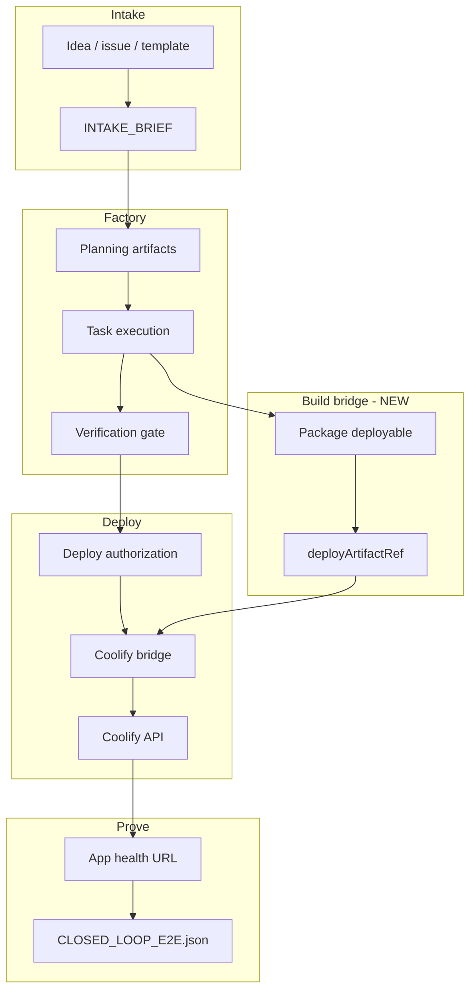

# Track B — Closed-Loop Product Factory (v1.1 Plan)

**Status:** Planning (post v1.0.0 GA)  
**Owner:** _TBD_  
**Depends on:** [v1.0.0 RELEASE_SCOPE.md](../releases/v1.0.0/RELEASE_SCOPE.md) (factory + integration shipped)  
**Goal:** One credible product loop — **idea → built artifact → deploy that artifact → health on the app URL** — without pre-provisioned placeholder apps or control-plane-only health.

---

## 1. Problem statement

v1.0.0 proves the **operating system** of the factory and **API deploy wiring**. It does not prove:

1. The **output of execution** is what gets deployed.
2. **Health** validates the running service users care about.
3. A **new operator** can succeed with one documented path and minimal Coolify prep.

Track B closes that gap so marketing and README can safely say “autonomous software factory” in the product sense.

---

## 2. Definition of done (v1.1 GA)

| # | Criterion | Verification |
|---|-----------|----------------|
| D1 | Single command `npm run factory:e2e` (or `npm run start -- …`) runs intake → execute → **API** deploy | `run_summary.deploymentMode === "api"` |
| D2 | Deploy target is **derived from the run** (image tag, compose project, or git SHA label), not a static pre-created nginx app | `CLOSED_LOOP_E2E.json` includes `deployArtifactRef` linked to run |
| D3 | Health check uses **application URL** (FQDN or published port); control-plane `/api/health` is fallback only | E2E fails if app URL unreachable when FQDN is configured |
| D4 | Execution leaves **detectable change** in repo or build output (file, version, image digest) | `execution_results.json` + deploy manifest cross-reference |
| D5 | Default agent path for E2E uses **non-shell** backend OR documented scaffold task that always mutates repo | Config flag `DEXTER_E2E_AGENT_BACKEND` |
| D6 | CI runs `factory:e2e` against mock OR staging Coolify with secrets | GitHub workflow job green |
| D7 | Docs: no “placeholder app” steps without labeling them dev-only | README + PRODUCTION_INTEGRATION updated |

---

## 3. Architecture target



**New component:** `DeployableArtifact` — a small contract written during release packaging that the control plane adapter consumes (image name:tag, compose file path, or Coolify app UUID + force redeploy).

---

## 4. Coolify deployment model (decision)

### Recommended: **B2a — One Coolify app per Dexter `project`**

| Aspect | Choice |
|--------|--------|
| Mapping | `project` name ↔ Coolify application name ↔ `apps.json` entry |
| First run | `factory:e2e` or `coolify:provision` creates app if missing (API `POST /applications/dockerimage` or public repo) |
| Subsequent runs | Same app; deploy passes new **image tag** or triggers **redeploy** with `force: true` |
| Health | Application `fqdn` + `health_check_path` from Coolify API |

**Why:** Matches mental model (one product = one app), reuse promotion pipeline app names, minimal UUID sprawl.

### Alternative: **B2b — Ephemeral app per run**

- App name `dexter-<runId short>`
- Provision on deploy, optional teardown post-verify
- **Pros:** Strong isolation; **Cons:** Coolify clutter, slower, harder promotion history

**Plan default:** implement **B2a** first; document B2b under “future.”

---

## 5. Workstreams

### B1 — Application health (1–2 days)

**Objective:** Health probes the deployed service, not only Coolify panel health.

#### Tasks

1. **`resolveClosedLoopHealthUrl` (enhance)**  
   - Order: (1) explicit `DEXTER_DEPLOY_HEALTH_URL` if `DEXTER_E2E_ALLOW_PANEL_HEALTH=true`, (2) Coolify app FQDN + path with probe, (3) published host port from `docker ps`/Coolify API, (4) fallback panel health with **warning** in report.
2. **`CLOSED_LOOP_E2E.json` schema v1.1**  
   - Add `health.source`, `health.appFqdn`, `health.fallbackUsed: boolean`.
3. **Fail E2E in strict mode**  
   - `DEXTER_E2E_STRICT_HEALTH=true` → fail if fallback used.
4. **Tests**  
   - Unit: resolution order with mocked fetch; integration: local FQDN probe skipped in CI.

#### Files

- `src/operations/closed-loop-e2e.ts`
- `tests/closed-loop-e2e.test.ts`
- `docs/operations/PRODUCTION_INTEGRATION.md`

#### Acceptance

- With `DEXTER_DEPLOY_HEALTH_URL` unset and app running, E2E uses FQDN and passes.
- With app down and strict mode, E2E fails with clear message.

---

### B2 — Deploy the run artifact (4–6 days)

**Objective:** Bridge deploy sends **this run’s** build output to Coolify.

#### Phase B2.1 — Deploy contract

Introduce `artifacts/release/DEPLOY_MANIFEST.json`:

```json
{
  "schemaVersion": "1.0",
  "runId": "uuid",
  "project": "sample-app",
  "artifactType": "docker_image",
  "image": "ghcr.io/org/sample-app:run-655e012f",
  "coolify": { "appName": "sample-app", "force": true }
}
```

| `artifactType` | v1.1 support |
|----------------|--------------|
| `docker_image` | **Yes** — primary |
| `docker_compose` | Stretch — compose path in repo |
| `git_sha` | Stretch — trigger Coolify redeploy by tag |

#### Phase B2.2 — Build step in orchestrator

After `createReleaseBundle`, before deploy:

1. **`buildDeployManifest(rootDir, runDir, project)`**  
   - If `DEXTER_BUILD_COMMAND` set, run it in workspace.  
   - Else default: write `Dockerfile` scaffold if missing + `docker build -t <image> .` (or skip build when `DEXTER_DEPLOY_IMAGE` provided).
2. Persist manifest under `runs/<id>/deploy_manifest.json` and copy to `artifacts/release/`.

**Pragmatic v1.1 default:** Use **pre-built image pattern** — execution task `release:package-docker` emits Dockerfile + tag; build runs once in orchestrator.

#### Phase B2.3 — Coolify API extensions

| API | Use |
|-----|-----|
| `PATCH /applications/{uuid}` | Update `docker_registry_image_name` / tag |
| `POST /deploy` | Existing; pass uuid + force |
| `POST /applications/dockerimage` | Provision app in `coolify:provision` |

New module: `src/providers/deployment/coolify-provision.ts`

- `ensureApplication(project, options)` → uuid, created: boolean

#### Phase B2.4 — Control plane adapter

`control-plane.ts` deploy path:

1. Read `deploy_manifest.json` from run dir (or latest).
2. If manifest present, call Coolify deploy with manifest image/tag (bridge body extension).
3. Bridge: accept optional `image`, `tag`, `force` in POST `/deploy` body.

#### Files (expected)

| File | Change |
|------|--------|
| `src/release/deploy-manifest.ts` | **New** — build + validate manifest |
| `src/core/orchestrator.ts` | Call build before deploy |
| `src/providers/deployment/coolify-bridge-server.ts` | Pass image/tag to client |
| `src/providers/deployment/coolify-client.ts` | `updateApplication`, `ensureApplication` |
| `src/dev/run-coolify-provision.ts` | **New** CLI |
| `infra/coolify/apps.example.json` | Document auto-provision |
| `tests/deploy-manifest.test.ts` | **New** |
| `tests/coolify-provision.test.ts` | **New** (mock API) |

#### Acceptance

- E2E run: `deploy_manifest.image` contains run id or git sha.
- Coolify deployment uses updated tag (verify via API GET application).
- `CLOSED_LOOP_E2E.json` includes `deployArtifactRef`.

---

### B3 — Agent backend / repo mutation (3–5 days)

**Objective:** Execution is not a no-op for closed-loop proof.

#### Options (pick one for v1.1)

| Option | Effort | Proof |
|--------|--------|-------|
| **B3a** Deterministic scaffold task | Low | Always writes `src/version.ts` with run id |
| **B3b** `cursor-cli` backend in E2E | Medium | Real edits; needs CI secret/skip |
| **B3c** `scripted` backend with fixture patch | Low | Applies unified diff from `templates/e2e-patch.diff` |

**Recommended:** **B3a + B3c** for CI; **B3b** documented for local dev.

#### Tasks

1. Add plan task template `closed-loop-smoke` when `DEXTER_CLOSED_LOOP_SMOKE=true`.
2. Task writes `artifacts/execution/RUN_STAMP.json` and updates `package.json` version field.
3. `buildDeployManifest` reads stamp for image tag.
4. Document `DEXTER_AGENT_BACKEND=cursor-cli` for local.

#### Acceptance

- `execution_results.json` shows passed task `closed-loop-stamp` (or equivalent).
- Deploy manifest tag includes stamp value.

---

### B4 — Default operator path (1–2 days)

**Objective:** One mental model; no parallel `factory:e2e` vs `intake:run` confusion.

#### Tasks

1. **`npm run factory`** alias → `factory:e2e` with env load.
2. **`intake:run`** respects `DEXTER_REQUIRE_API_DEPLOY` when bridge env present.
3. **Bootstrap script** `npm run factory:bootstrap` — checks docker, coolify health, runs `coolify:setup`, prints bridge command.
4. README quickstart path:
   - Bootstrap → bridge → factory → promotion (optional).

#### Acceptance

- README quickstart matches three terminals or compose stack (future).

---

### B5 — CI and staging (2–3 days, parallel)

1. GitHub Actions job `closed-loop-e2e`:
   - Job 1: `coolify:integration-drill` (existing mock).
   - Job 2 (optional, manual): staging Coolify with secrets.
2. Strict E2E in CI uses mock control plane **or** drill-only; document staging workflow_dispatch.
3. Upload `CLOSED_LOOP_E2E.json` as artifact.

---

## 6. Sequencing and timeline

| Week | Deliverable | Exit |
|------|-------------|------|
| W1 | B1 strict health + B3a stamp task | E2E fails without app URL in strict mode; repo mutates |
| W2 | B2.1–B2.4 deploy manifest + bridge | Deploy uses manifest image tag |
| W3 | B2 provision + B4 docs/bootstrap | New project auto-provisions Coolify app |
| W4 | B5 CI + v1.1 RC soak | Tag `v1.1.0-rc1` |
| W5 | Staging validation + GA | Tag `v1.1.0` |

**Critical path:** B2 → B1 (strict) → B3 → B4 → B5

---

## 7. API and schema changes (summary)

### Bridge POST `/deploy` body (v1.1)

```json
{
  "appName": "sample-app",
  "action": "deploy",
  "authorizationToken": "...",
  "image": "ghcr.io/org/sample-app",
  "tag": "run-655e012f",
  "force": true
}
```

### Environment variables (new)

| Variable | Purpose |
|----------|---------|
| `DEXTER_E2E_STRICT_HEALTH` | Fail if only panel health works |
| `DEXTER_E2E_ALLOW_PANEL_HEALTH` | Allow panel health in non-strict E2E |
| `DEXTER_BUILD_COMMAND` | Override build for deploy manifest |
| `DEXTER_DEPLOY_IMAGE` | Static image repo for smoke |
| `DEXTER_CLOSED_LOOP_SMOKE` | Inject stamp task into plan |
| `DEXTER_COOLIFY_AUTO_PROVISION` | Create app if missing |

---

## 8. Risks and mitigations

| Risk | Impact | Mitigation |
|------|--------|------------|
| Coolify app unreachable on Docker Desktop | E2E flaky | Document Traefik/proxy start; host port discovery |
| Docker build slow in orchestrator | Long runs | Optional skip-build with pre-pushed smoke image |
| `cursor-cli` unavailable in CI | B3 blocked | Deterministic stamp task for CI only |
| Image registry auth | Push fails | Local registry container for dev; ghcr secrets for staging |
| Promotion uses wrong app | Prod incident | `apps.json` schema version + preflight app name check |

---

## 9. Testing strategy

| Layer | What |
|-------|------|
| Unit | deploy manifest, health resolution, provision client (mock fetch) |
| Integration | bridge deploy with image tag (mock Coolify server) |
| Local E2E | `factory:e2e` strict against local Coolify |
| CI | integration-drill + unit; optional staging workflow |
| UAT | Operator runs GA checklist on staging Coolify |

---

## 10. Documentation deliverables (Track B)

- Update `README.md` — v1.1 closed-loop quickstart
- `docs/operations/PRODUCTION_INTEGRATION.md` — provision, strict health, manifest
- `docs/releases/v1.1.0/RELEASE_SCOPE.md` — product GA criteria
- Deprecate “manual nginx app” local setup as **dev shortcut only** in `infra/coolify/local/README.md`

---

## 11. Open questions (resolve in kickoff)

1. **Registry:** GHCR, local registry, or Coolify pull-through only?
2. **Build in repo:** Require `Dockerfile` in every project or generate from template?
3. **Multi-service projects:** One app per repo or per service name (dexter-ops-api)?
4. **Teardown:** Keep Coolify apps after run for promotion history or prune?

**Default answers for planning:** GHCR optional / local for dev; generate Dockerfile if missing; one app per `project`; keep apps.

---

## 12. Success metrics (v1.1)

| Metric | Target |
|--------|--------|
| `factory:e2e` strict pass rate on staging | 3/3 consecutive |
| Median E2E duration | < 10 min (with build) |
| Zero simulated deploys when `DEXTER_REQUIRE_API_DEPLOY=true` | 100% |
| Operator setup steps (excluding secrets) | ≤ 5 commands |

---

## Appendix A — Mapping v1.0 commands to v1.1

| v1.0 | v1.1 change |
|------|-------------|
| `factory:e2e` | Uses deploy manifest + strict health |
| `coolify:setup` | Calls `coolify:provision` if auto-provision on |
| `run:sample` | Unchanged; not the GA proof |
| `promotion:pipeline` | Reads manifest app name; same stages |
| `intake:run` | API deploy when env wired (B4) |

---

## Appendix B — Reference: current v1.0 closed-loop gaps

| Gap | Track B phase |
|-----|----------------|
| Health = `127.0.0.1:8001/api/health` | B1 |
| Coolify app = static nginx | B2 |
| Agent = shell, no required mutation | B3 |
| Pre-existing `apps.json` UUID | B2 provision |
| Separate `factory:e2e` vs product run | B4 |
